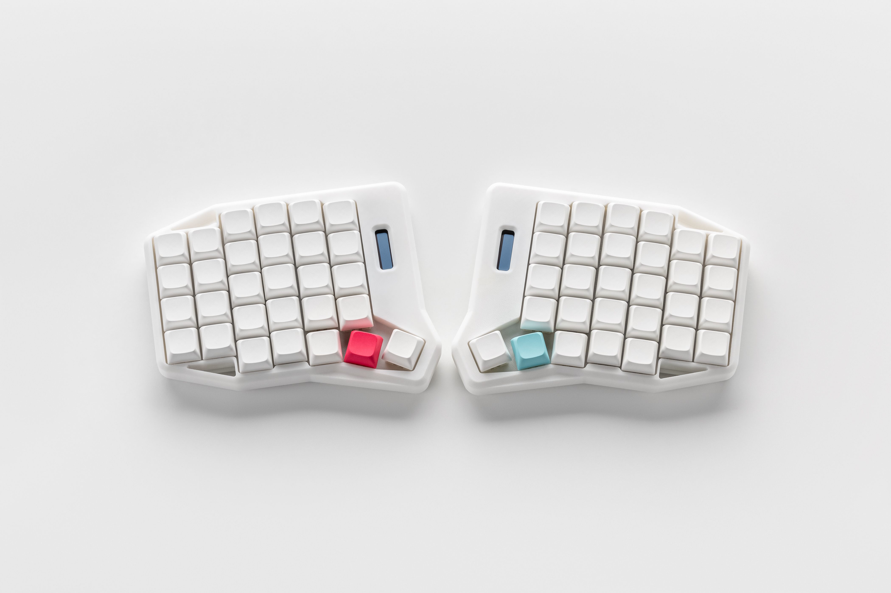

## K:02 is an ergonomic split mechanical keyboard with 5 thumb keys on each half

### This repo contains all files related to this keyboard
PCB and schematic can be found [here](https://oshwlab.com/yuriiq/k02)

## License 

The files in this repository are licensed under a Creative Commons Attribution-NonCommercial-ShareAlike 4.0 International License.

## Firmware
| [Pre-compiled files][1]  | [Source code][20] |

[1]: https://github.com/ergohaven/keymap_hub
[2]: https://github.com/ergohaven/vial-qmk/tree/vial/keyboards/ergohaven
